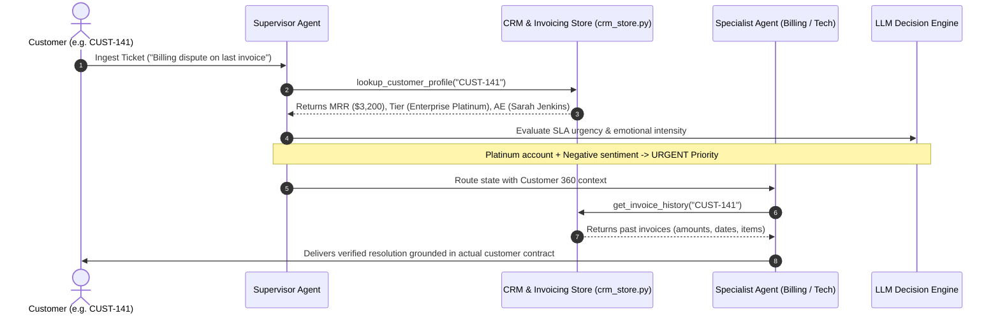

# Architecture Deep Dive: Customer Support Triage System

This document provides a comprehensive technical breakdown of the multi-agent architecture implemented in **Project 2: Customer Support Triage Agent**. Use this guide to understand the internal mechanics of LangGraph state transitions, checkpointing, and enterprise CRM data integration.

---

## 1. Why the Supervisor Pattern?

When building agentic applications, developers typically start with one of two flawed patterns:

### Flaw 1: The Monolithic Agent
- One LLM prompt with 20+ tool definitions (SQL queries, refund endpoints, server restart scripts).
- **Problems:**
  - **Tool Confusion:** High error rate where the model calls unrelated tools.
  - **Context Bloat:** All documentation, logs, and billing policies must fit into a single system prompt.
  - **Lack of Authorization Boundaries:** The LLM could accidentally invoke `process_refund` when answering a simple question.

### Flaw 2: The Sequential Pipeline (Chain)
- Input -> Agent A -> Agent B -> Agent C -> Output.
- **Problems:**
  - **Latency:** Every ticket passes through every agent, even if Agent A has nothing to do with it.
  - **Cost:** Multiple LLM calls for every single request.
  - **Error Propagation:** If Agent B hallucinates, Agent C acts on tainted state.

### The Solution: The Supervisor Pattern
```
                  [Customer Ticket]
                          │
                          ▼
                ┌──────────────────┐
                │ Supervisor Node  │◄───────[Customer 360 & SLA Profile]
                └─────────┬────────┘
        ┌─────────────────┼─────────────────┐
        ▼                 ▼                 ▼
┌──────────────┐   ┌──────────────┐   ┌──────────────┐
│Billing Agent │   │  Tech Agent  │   │Escalation Ag.│
└───────┬──────┘   └──────┬───────┘   └──────┬───────┘
        │ (Invoices)      │ (Telemetry)      │ (Exec Dossier)
        └─────────────────┼──────────────────┘
                          ▼
             [Human Gate / Checkpoint]
                          │
                          ▼
                 [Delivered Response]
```

- **Specialization:** Each agent only knows its domain and holds 2-3 focused tools.
- **Dynamic Routing:** Only the relevant agent is invoked.
- **Safety Gate:** Actions with financial or legal consequences converge on a centralized checkpoint.

---

## 2. Enterprise Customer CRM & Invoicing Integration (`src/crm_store.py`)

A critical weakness in naive support agent demos is the absence of **actual customer master data**. A ticket is only a transient inquiry—without customer identity, SLA contracts, and billing ledger history, an agent cannot make sound business decisions.

### Customer 360 Resolution Architecture
When a ticket is ingested, the system binds it to a verified customer record:



### Dataset Scale
- **Master Customer Directory:** 602 Enterprise Accounts in [`data/customers.csv`](file:///data/customers.csv) representing **$298,830.00 MRR** (~**$3.58M ACV**).
- **Invoicing Ledger:** 2,207 Historical Invoices in [`data/invoices.csv`](file:///data/invoices.csv) with itemized descriptions and paid/disputed states.
- **Support Tickets:** 1,000 Authentic Production Tickets in [`data/customer_support_tickets_1000.csv`](file:///data/customer_support_tickets_1000.csv).

---

## 3. Shared State Architecture (`src/state.py`)

LangGraph operates on a **Single Source of Truth** called `State`.

```python
class TriageState(TypedDict):
    # 1. Message Channel with Reducer
    messages: Annotated[List[BaseMessage], add_messages]

    # 2. Metadata & Customer CRM Context
    ticket_id: str
    customer_id: str
    customer_tier: str
    ticket_category: Optional[Literal["billing", "technical", "escalation"]]
    sentiment: Optional[Literal["POSITIVE", "NEUTRAL", "FRUSTRATED", "ANGRY"]]
    priority: Optional[Literal["LOW", "MEDIUM", "HIGH", "CRITICAL"]]
    churn_risk: Optional[bool]
    
    # 3. Actions & Approvals
    draft_response: Optional[str]
    actions_taken: List[str]
    requires_human_approval: bool
    approval_reason: Optional[str]
    human_decision: Optional[Literal["approve", "reject", "edit"]]
    final_response: Optional[str]
    status: str
```

### The `add_messages` Reducer
By default, LangGraph replaces dictionary keys with the newly returned value. However, conversation history needs to **append**.
`Annotated[List[BaseMessage], add_messages]` tells LangGraph:
- Whenever a node returns `{"messages": [new_message]}`, append it to the existing list instead of overwriting it.
- Deduplicates messages if IDs match.

---

## 4. Human-in-the-Loop (HITL) Mechanics

In traditional programming, waiting for a human requires keeping a thread sleeping or setting up a database polling worker.
In LangGraph, **state persistence and interruption are native first-class primitives**:

```python
graph = builder.compile(
    checkpointer=MemorySaver(),
    interrupt_before=["human_review"],
)
```

### Execution Lifecycle:
1. **Invocation:** `graph.invoke(initial_state, config={"configurable": {"thread_id": "ticket-102"}})`
2. **Execution:**
   - `START` -> `supervisor` executes and routes to `billing_specialist`.
   - `billing_specialist` evaluates refund amount ($250 > $50 threshold).
   - Sets `requires_human_approval = True`.
   - Conditional edge detects `requires_human_approval == True` and points to `human_review`.
3. **The Interrupt:**
   - Because `interrupt_before=["human_review"]` is set, LangGraph serializes the entire `TriageState` to the checkpointer and stops execution immediately.
   - `graph.get_state(config).next` returns `("human_review",)`.
4. **Human Review:**
   - A support manager inspects the thread via the API or CLI.
   - The manager decides to approve, edit, or reject the draft.
   - `graph.update_state(config, {"human_decision": "approve"})` injects the human's decision into the persistent thread checkpoint.
5. **Resumption:**
   - `graph.invoke(None, config=config)` is called with `None` as the input.
   - LangGraph detects the pending checkpoint, restores state, executes `human_review`, and terminates at `END`.

---

## 5. Production Hardening Checklist (Course Lecture 8 Alignment)

When moving this project from local testing to enterprise production:

| Concern | Development (Current) | Production Setup |
| :--- | :--- | :--- |
| **CRM Data Layer** | In-memory CSV cache (`src/crm_store.py`) | Salesforce / HubSpot / PostgreSQL CRM integration. |
| **Checkpointer** | `MemorySaver` (in-memory) | `PostgresSaver` or `SqliteSaver` for durable persistence across server restarts. |
| **Observability** | Console logs | Enable `LANGCHAIN_TRACING_V2=true` for full LangSmith tracing. |
| **Concurrency** | Single-threaded | Distributed workers keyed by `thread_id`. |
| **Authentication** | Open REST API | JWT / OAuth2 tokens validating human agent roles. |
| **Rate Limiting** | None | Token bucket rate limiting in FastAPI middleware. |
