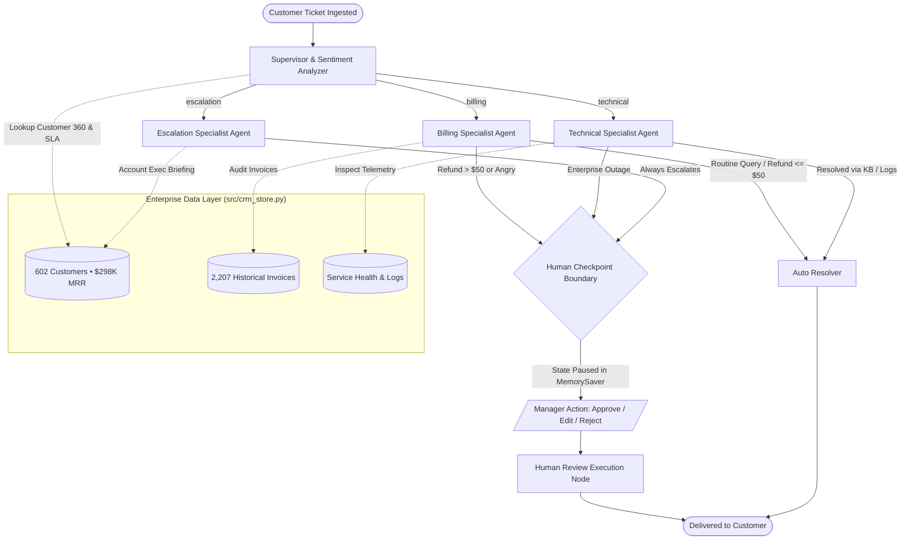

# Project 2: Customer Support Triage Agent (Supervisor Pattern + Human-in-the-Loop)

> **Course:** LangGraph Multi-Agent Projects: Build 6 Production-Ready AI Agent Systems  
> **Lecture 3:** Customer Support Triage Agent (25 - 28 min)  
> **Level:** Intermediate Python / AI Developers  
> **Focus Architecture:** The Supervisor Pattern, Specialist Agent Orchestration, Human-in-the-Loop (HITL) Checkpointing, and Enterprise Customer CRM & Invoicing Integration

---

## 📌 Executive Summary

Single-agent LLM systems quickly fall apart in real customer support operations. When one model tries to look up database records, diagnose infrastructure errors, issue credit refunds, and handle angry churn threats simultaneously, it suffers from **tool confusion**, hallucinated policy violations, and lack of compliance guardrails.

This project implements the industry-standard **Supervisor Pattern** using **LangGraph**:
1. **Central Supervisor Router**: Analyzes incoming tickets, extracts **Customer Sentiment** and **Priority**, and delegates to domain-specialist agents.
2. **Three Specialist Agents**:
   - **Billing Specialist:** Queries customer subscriptions, audits invoices, and issues refunds with deterministic code-level guards.
   - **Technical Support Specialist:** Inspects real-time service health, reviews error stack traces, and queries the knowledge base.
   - **Escalation Specialist:** Compiles executive briefings for VIP accounts and lawsuit/legal disputes.
3. **Enterprise Customer CRM & Invoicing Layer**:
   - **602 Authentic Customer Accounts** ([`data/customers.csv`](file:///data/customers.csv)) managing **$298,830.00 MRR** (~**$3.58M ACV**) across Enterprise Platinum, Gold, and Standard SLA tiers.
   - **2,207 Historical Invoices** ([`data/invoices.csv`](file:///data/invoices.csv)) tracking billing line items, dates, and payment states.
   - **1,000 Enterprise Support Tickets** ([`data/customer_support_tickets_1000.csv`](file:///data/customer_support_tickets_1000.csv)) with $216K+ in disputes, SAML SSO errors, and VIP SLAs.
4. **Human-in-the-Loop (HITL) Checkpoint**: Automatically pauses execution before high-risk actions (refunds > $50, severe customer distress, or executive escalations) using LangGraph's persistent `MemorySaver` checkpointer. A human supervisor can **Approve**, **Edit**, or **Reject** the draft before it reaches the customer.
5. 🏆 **Trophy Challenge Built-In**: A dedicated **Sentiment-Based Priority Rule** engine that identifies customer distress and automatically elevates ticket priority.
6. 🌐 **Interactive Web Presentation & Simulation Studio**: A 14-slide slide deck in [`web/index.html`](file:///web/index.html) with 4 themes, live Mermaid diagrams, speaker notes drawer, pop-out presenter mode, and interactive 1,000-ticket simulation step controller.

---

## 📐 System Architecture



---

## 🗂️ Project File Structure

```
Project 2 Customer Support Triage Agent/
├── .env.example                      # Environment variables template (OpenAI / OpenRouter settings)
├── .env                              # Local environment configuration
├── .gitignore                        # Git ignore for venvs, caches, and databases
├── requirements.txt                  # Frozen, verified dependencies
├── README.md                         # Complete project guide and lecture script
├── ARCHITECTURE.md                   # Deep-dive architecture reference for students
├── QUIZ_AND_CHALLENGE.md             # Quiz 3 questions & answers + Trophy Challenge walkthrough
├── RUNNER.md                         # End-to-end command-by-command testing guide
├── run_triage.py                     # Rich interactive CLI runner (5 execution modes)
├── data/
│   ├── customers.csv                 # 602 Enterprise Customer CRM profiles ($298K MRR)
│   ├── invoices.csv                  # 2,207 Historical Invoices ledger
│   └── customer_support_tickets_1000.csv # 1,000 Authentic enterprise support tickets
├── scripts/
│   ├── generate_customer_data.py     # Deterministic generator for customers & invoices
│   └── generate_tickets_dataset.py   # Generator for 1,000 realistic support tickets
├── src/
│   ├── __init__.py
│   ├── config.py                     # Settings, thresholds (refund limit $50), feature flags
│   ├── state.py                      # TriageState TypedDict schema & LangGraph reducers
│   ├── crm_store.py                  # Enterprise CRM profiles, invoice ledger & telemetry
│   ├── mock_data.py                  # Backward-compatibility wrapper re-exporting crm_store
│   ├── data_loader.py                # CSV loader, pagination, search & customer analytics
│   ├── llm.py                        # LLM factory (OpenRouter gateway + Mock LLM fallback)
│   ├── graph.py                      # StateGraph builder, conditional edges, MemorySaver
│   ├── api.py                        # Production FastAPI application (Tickets + Customers API)
│   ├── tools/
│   │   ├── __init__.py
│   │   ├── billing_tools.py          # Profile lookup, invoice history, refund processor
│   │   └── tech_tools.py             # Health checker, log inspector, knowledge base search
│   └── agents/
│       ├── __init__.py
│       ├── supervisor.py             # Supervisor router + Sentiment-Based Priority Rule
│       ├── billing_agent.py          # Billing specialist node with $50 threshold gate
│       ├── tech_agent.py             # Technical specialist node with telemetry & KB
│       ├── escalation_agent.py        # Escalation specialist node with executive dossier
│       └── human_review.py           # Human review resolution node
├── tests/
│   ├── __init__.py
│   ├── test_tickets.py               # Messy real-world support ticket test cases
│   ├── test_graph_flow.py            # Pytest unit tests for graph routing & HITL
│   ├── test_llm_openrouter.py        # OpenRouter & Mock LLM provider tests
│   └── test_api.py                   # FastAPI REST endpoint & customer CRM tests
└── web/
    ├── index.html                    # 14-slide interactive master presentation & simulation
    ├── styles.css                    # Professional dark/light themes & glassmorphic layout
    ├── script.js                     # Slide engine, simulation step controller & search
    ├── SPEAKER_SCRIPT.md             # Instructor's live teleprompter script (25-28 min)
    └── data/
        ├── customers.json            # 602 synced customer profiles for web app
        ├── invoices.json             # 2,207 synced invoice records for web app
        ├── customer_support_tickets_1000.csv
        └── customer_support_tickets_1000.json
```

---

## 🚀 Quick Start Guide

### 1. Prerequisites
- Python 3.10+ (tested on Python 3.12 and 3.14)
- Git

### 2. Setup Virtual Environment
```bash
# Clone or navigate to the project directory
cd "Project 2 Customer Support Triage Agent"

# Initialize virtual environment
python -m venv .venv

# Activate virtual environment
# Windows (PowerShell):
.\.venv\Scripts\Activate.ps1
# Windows (CMD):
.venv\Scripts\activate.bat
# Linux/macOS:
source .venv/bin/activate

# Install dependencies
pip install -r requirements.txt
```

### 3. Configure OpenRouter / LLM Provider (Optional)
The system supports **OpenRouter**, **Direct OpenAI**, and a zero-cost **Deterministic Mock Mode**!

To enable **OpenRouter** (access any model like GPT-4o, Claude 3.5 Sonnet, Llama 3.3):
1. Open `.env`
2. Configure your OpenRouter key:
   ```env
   LLM_PROVIDER=openrouter
   OPENROUTER_API_KEY=sk-or-v1-...
   MODEL_NAME=openai/gpt-4o-mini
   ```
*(Popular OpenRouter models you can use: `openai/gpt-4o-mini`, `anthropic/claude-3.5-sonnet`, `meta-llama/llama-3.3-70b-instruct`)*

If no API key is provided, the agent automatically runs in **Mock Mode**, allowing students to test all graph flows and HITL checkpoints offline with zero API setup!

---

## 🎮 How to Run the Project (5 Powerful Modes)

### Mode 1: Customer CRM Directory & Portfolio Analytics
Inspect the 602 enterprise customer accounts, MRR metrics, and top accounts:
```bash
python run_triage.py --mode customers
```

### Mode 2: Interactive Console & Customer 360 Submission
Select any customer (e.g. `CUST-141`, `CUST-002`, `CUST-737`), view their live Customer 360 profile, and submit custom questions/tickets as that verified customer:
```bash
# Submit a ticket as a specific enterprise customer
python run_triage.py --mode interactive --customer CUST-141

# Or run generic interactive console
python run_triage.py --mode interactive
```

### Mode 3: 1,000 Production Tickets Dataset Explorer
Query and filter the 1,000 authentic production tickets directly from your terminal:
```bash
python run_triage.py --mode dataset
```

### Mode 4: Batch Stress-Test Suite (Recommended for Quick Demo)
Runs the graph across messy real-world tickets, showing routing, tool calls, and HITL pauses:
```bash
python run_triage.py --mode batch
```

### Mode 5: Architecture Diagram
Outputs the Mermaid code and ASCII diagram:
```bash
python run_triage.py --mode diagram
```

---

## 🧪 Automated Pytest Suite (17 Tests)

Run the comprehensive test suite verifying the graph flow, sentiment challenge, OpenRouter gateway, and customer CRM APIs:
```bash
pytest tests/ -v
```

Expected result: **17 passed** in ~1.5 minutes.

---

## 🌐 Launch the Production FastAPI Server

```bash
uvicorn src.api:app --reload --port 8000
```

Visit **http://127.0.0.1:8000/docs** to test the interactive Swagger UI:
- `GET /api/customers`: List and search 602 enterprise customers (with tier and search query filters).
- `GET /api/customers/{customer_id}`: Customer 360 profile (MRR, ACV, SLA tier, payment history).
- `POST /api/customers/{customer_id}/ticket`: Ingest a ticket authored by a specific customer.
- `GET /api/invoices`: Query invoice ledger filtered by customer or status.
- `GET /api/dataset/stats`: Real-time KPI analytics on the 1,000-ticket dataset.
- `GET /api/dataset/tickets`: Paginated ticket query with category, sentiment, and keyword filters.
- `POST /api/tickets/triage`: Ingest a ticket.
- `GET /api/tickets/{thread_id}/state`: Inspect paused checkpoint state.
- `POST /api/tickets/{thread_id}/resume`: Submit manager review (`approve`, `edit`, `reject`).

---

## 🖥️ Interactive Web Presentation & Simulation Studio

Open [`web/index.html`](file:///web/index.html) in your browser:
- **Slide Navigation:** Use arrow keys `←` and `→` or click the toolbar buttons.
- **4 Themes:** Midnight Cyan, Obsidian Emerald, Sunset Aurora, and Studio Light.
- **Dataset Studio (Slide 10):** Search and filter all 1,000 tickets, inspect details, and use the **Next Step** / **Prev Step** / **Auto Play** step controller to watch LangGraph agents reason in real time!
- **Speaker Notes (Press S):** Pull up the instructor teleprompter notes drawer.
- **Pop-out Window (Press P):** Move the teleprompter onto a secondary monitor while presenting.

---

## 🏆 Trophy Challenge: Sentiment-Based Priority Rule

### The Challenge Statement
*"Standard ticket routers only look at semantic keywords (e.g. 'refund' -> Billing). In production, an angry customer threatening to cancel needs urgent attention, regardless of topic. Add a sentiment-based priority rule that dynamically alters priority and routing based on customer emotional state."*

### Our Implementation ([src/agents/supervisor.py](file:///src/agents/supervisor.py))
1. **Multi-Dimensional Sentiment Extraction**:
   - The supervisor predicts `category`, `sentiment` (`POSITIVE`, `NEUTRAL`, `FRUSTRATED`, `ANGRY`), `urgency` (`LOW`, `MEDIUM`, `HIGH`, `CRITICAL`), and `churn_risk` (`True`/`False`).
2. **Dynamic Rule Overrides**:
   - **Legal/Lawsuit Threat:** Immediately bumps to `CRITICAL` and routes to `escalation_specialist`.
   - **Financial Dispute with High Anger or Churn Threat:** Bumps priority to `HIGH` and flags for mandatory human manager review before sending response (`ENFORCE_SENTIMENT_HUMAN_GATE = True`).
   - **Active Production Outage:** Automatically bumps priority to `HIGH`.

---

## 📄 License & Attribution
Developed as part of the *LangGraph Multi-Agent Systems* Masterclass series. Free to use for educational and commercial applications.
