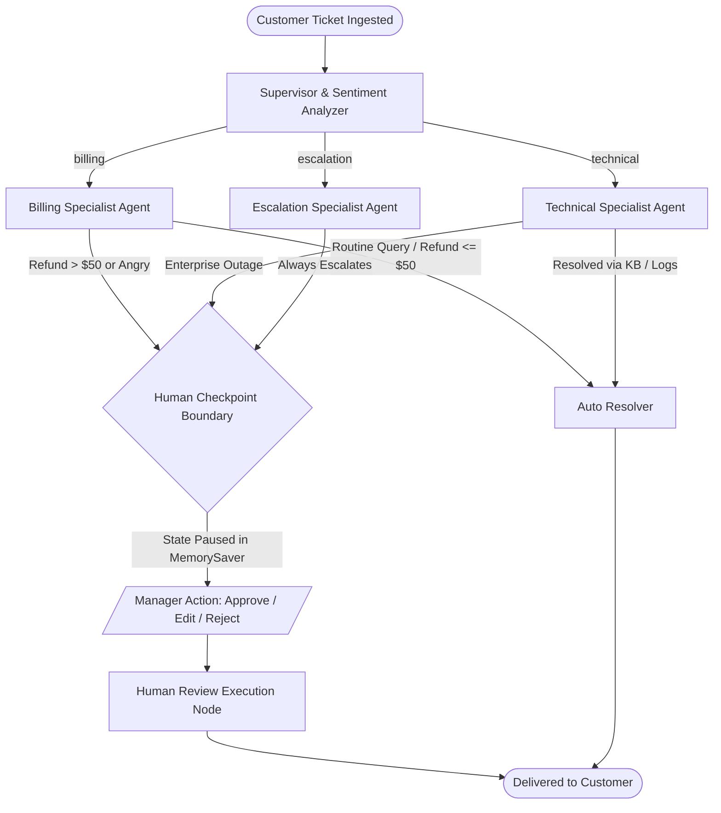

# Project 2: Customer Support Triage Agent (Supervisor Pattern + Human-in-the-Loop)

> **Course:** LangGraph Multi-Agent Projects: Build 6 Production-Ready AI Agent Systems  
> **Lecture 3:** Customer Support Triage Agent (17 min)  
> **Level:** Intermediate Python / AI Developers  
> **Focus Architecture:** The Supervisor Pattern, Specialist Agent Orchestration, and Human-in-the-Loop (HITL) Checkpointing

---

## 📌 Executive Summary

Single-agent LLM systems quickly fall apart in real customer support operations. When one model tries to look up database records, diagnose infrastructure errors, issue credit refunds, and handle angry churn threats simultaneously, it suffers from **tool confusion**, hallucinated policy violations, and lack of compliance guardrails.

This project implements the industry-standard **Supervisor Pattern** using **LangGraph**:
1. A central **Supervisor Router** analyzes incoming tickets, extracts **Customer Sentiment** and **Priority**, and delegates to domain-specialist agents.
2. **Three Specialist Agents** independently handle their domains:
   - **Billing Specialist:** Queries customer subscriptions, audits invoices, and issues refunds.
   - **Technical Support Specialist:** Inspects real-time service health, reviews error stack traces, and queries the knowledge base.
   - **Escalation Specialist:** Compiles executive briefings for VIP accounts and lawsuit/legal disputes.
3. **Human-in-the-Loop (HITL) Checkpoint:** Automatically pauses execution before high-risk actions (refunds > $50, severe customer distress, or executive escalations) using LangGraph's persistent `MemorySaver` checkpointer. A human supervisor can **Approve**, **Edit**, or **Reject** the draft before it reaches the customer.
4. 🏆 **Trophy Challenge Built-In:** A dedicated **Sentiment-Based Priority Rule** engine that identifies customer distress and automatically elevates ticket priority.

---

## 📐 System Architecture



---

## 🗂️ Project File Structure

```
Project 2 Customer Support Triage Agent/
├── .env.example              # Environment variables template (OpenAI / Mock settings)
├── .env                      # Local environment configuration
├── .gitignore                # Git ignore for venvs, caches, and databases
├── requirements.txt          # Frozen, verified dependencies
├── README.md                 # Complete project guide and lecture script
├── ARCHITECTURE.md           # Deep-dive architecture reference for students
├── QUIZ_AND_CHALLENGE.md     # Quiz 3 questions & answers + Trophy Challenge walkthrough
├── run_triage.py             # Rich interactive CLI runner (Batch, Interactive, Diagram)
├── src/
│   ├── __init__.py
│   ├── config.py             # Settings, thresholds (refund limit $50), feature flags
│   ├── state.py              # TriageState TypedDict schema & LangGraph reducers
│   ├── mock_data.py          # Realistic mock CRM, invoices, system health telemetry
│   ├── llm.py                # LLM factory (OpenAI gpt-4o-mini + Mock LLM fallback)
│   ├── graph.py              # StateGraph builder, conditional edges, MemorySaver
│   ├── api.py                # Production FastAPI application
│   ├── tools/
│   │   ├── __init__.py
│   │   ├── billing_tools.py  # Profile lookup, invoice history, refund processor
│   │   └── tech_tools.py     # Health checker, log inspector, knowledge base search
│   └── agents/
│       ├── __init__.py
│       ├── supervisor.py     # Supervisor router + Sentiment-Based Priority Rule
│       ├── billing_agent.py  # Billing specialist node with $50 threshold gate
│       ├── tech_agent.py     # Technical specialist node with telemetry & KB
│       ├── escalation_agent.py# Escalation specialist node with executive dossier
│       └── human_review.py   # Human review resolution node
└── tests/
    ├── __init__.py
    ├── test_tickets.py       # 6 messy real-world support ticket test cases
    ├── test_graph_flow.py    # Pytest unit tests for graph routing & HITL
    └── test_api.py           # FastAPI endpoint tests
```

---

## 🚀 Quick Start Guide

### 1. Prerequisites
- Python 3.10+ (tested on Python 3.12 and 3.14)
- Git

### 2. Setup Virtual Environment (`vn`)
```bash
# Clone or navigate to the project directory
cd "Project 2 Customer Support Triage Agent"

# Initialize virtual environment named 'vn'
python -m venv vn

# Activate virtual environment
# Windows (PowerShell):
vn\Scripts\Activate.ps1
# Windows (CMD):
vn\Scripts\activate.bat
# Linux/macOS:
source vn/bin/activate

# Install dependencies
pip install -r requirements.txt
```

### 3. Configure OpenRouter / LLM Provider (Optional)
The system supports **OpenRouter**, **Direct OpenAI**, and a zero-cost **Deterministic Mock Mode**!

To enable **OpenRouter** (access any model like GPT-4o, Claude 3.5 Sonnet, Llama 3.3):
1. Open `.env`
2. Configure your OpenRouter key:
   ```env
   LLM_PROVIDER=openrouter
   OPENROUTER_API_KEY=sk-or-v1-...
   MODEL_NAME=openai/gpt-4o-mini
   ```
*(Popular OpenRouter models you can use: `openai/gpt-4o-mini`, `anthropic/claude-3.5-sonnet`, `meta-llama/llama-3.3-70b-instruct`)*

If no API key is provided, the agent automatically runs in **Mock Mode**, allowing students to test all graph flows and HITL checkpoints offline with zero API setup!

---

## 🎮 How to Run the Project

### Option A: Run the Batch Stress-Test Suite (Recommended for quick demo)
Runs the graph across all 6 messy real-world tickets, showing routing, tool calls, and HITL pauses:
```bash
python run_triage.py --mode batch
```

### Option B: Run the Interactive Support Console
Type your own support ticket live, watch the agents reason, and experience the human approval prompt:
```bash
python run_triage.py --mode interactive
```

### Option C: View the Architecture Diagram
Outputs the Mermaid code and ASCII diagram:
```bash
python run_triage.py --mode diagram
```

### Option D: Run Automated Pytest Suite
```bash
pytest tests/ -v
```

### Option E: Launch the Production FastAPI Server
```bash
uvicorn src.api:app --reload --port 8000
```
Then visit **http://127.0.0.1:8000/docs** to test the interactive Swagger UI:
- `POST /api/tickets/triage`: Ingest a ticket.
- `GET /api/tickets/{thread_id}/state`: Inspect paused checkpoint state.
- `POST /api/tickets/{thread_id}/resume`: Submit manager review (`approve`, `edit`, `reject`).

---

## 🧪 The 6 Messy Support Tickets (Stress-Test Cases)

| Ticket ID | Scenario | Department | Sentiment | Priority | Human Review? | Outcome |
| :--- | :--- | :--- | :--- | :--- | :--- | :--- |
| **TIK-101** | Routine Billing Query | Billing | NEUTRAL | LOW | Auto-Resolved | Invoice confirmed, refund not needed. |
| **TIK-102** | Furious $250 Refund Demand | Billing | ANGRY | HIGH | **PAUSED (HITL)** | Amount > $50 & anger triggers manager sign-off. |
| **TIK-103** | Cryptic 503 Stack Trace | Technical | FRUSTRATED | HIGH | Auto-Resolved | Queries telemetry, references active incident INC-8821. |
| **TIK-104** | VIP Lawsuit & SLA Threat | Escalation | ANGRY | CRITICAL | **PAUSED (HITL)** | Pages dedicated account manager, generates dossier. |
| **TIK-105** | Ambiguous Multi-Intent | Tech / Bill | NEUTRAL | LOW | Auto-Resolved | Resolves ambiguity and provides guidance. |
| **TIK-106** | Routine API Doc Query | Technical | NEUTRAL | LOW | Auto-Resolved | Direct answer from Knowledge Base article KB-303. |

---

## 🏆 Trophy Challenge: Sentiment-Based Priority Rule

### The Challenge Statement
*"Standard ticket routers only look at semantic keywords (e.g. 'refund' -> Billing). In production, an angry customer threatening to cancel needs urgent attention, regardless of topic. Add a sentiment-based priority rule that dynamically alters priority and routing based on customer emotional state."*

### Our Implementation ([src/agents/supervisor.py](file:///src/agents/supervisor.py))
1. **Multi-Dimensional Sentiment Extraction**:
   - The supervisor predicts `category`, `sentiment` (`POSITIVE`, `NEUTRAL`, `FRUSTRATED`, `ANGRY`), `urgency` (`LOW`, `MEDIUM`, `HIGH`, `CRITICAL`), and `churn_risk` (`True`/`False`).
2. **Dynamic Rule Overrides**:
   - **Legal/Lawsuit Threat:** Immediately bumps to `CRITICAL` and routes to `escalation_specialist`.
   - **Financial Dispute with High Anger or Churn Threat:** Bumps priority to `HIGH` and flags for mandatory human manager review before sending response (`ENFORCE_SENTIMENT_HUMAN_GATE = True`).
   - **Active Production Outage:** Automatically bumps priority to `HIGH`.

---

## 👨‍🏫 Instructor's Lecture Delivery Guide (17 Minutes)

Use this script during your video recording for Udemy Lecture 3:

### ⏱️ Timestamp Breakdown

| Minute | Phase | Screen View | What to Say / Demonstrate |
| :--- | :--- | :--- | :--- |
| **0:00 - 3:00** | **The Trap & The Supervisor Pattern** | Slide: Chain vs Supervisor | Explain why passing tickets in a single long chain fails. Introduce the Supervisor Pattern: a central brain that routes directly to specialists. |
| **3:00 - 6:30** | **State & Tools Design** | Code: `state.py`, `tools/` | Walk through `TriageState`. Highlight `add_messages` reducer. Show how `billing_tools.py` and `tech_tools.py` provide grounded facts without hallucination. |
| **6:30 - 10:00** | **Building the 3 Specialists** | Code: `agents/` | Show the Billing Agent refund threshold ($50 rule). Show Technical Agent querying system health. Show Escalation Agent preparing executive dossiers. |
| **10:00 - 13:00** | **Human-in-the-Loop Checkpointing** | Code: `graph.py` | Explain `MemorySaver` checkpointer. Explain `interrupt_before=["human_review"]`. Show how LangGraph pauses execution cleanly. |
| **13:00 - 15:30** | **Live Demo: Stress-Testing Messy Tickets** | Terminal: `run_triage.py` | Run `python run_triage.py --mode batch`. Show TIK-101 auto-resolving, then show TIK-102 pausing at the red HITL checkpoint. |
| **15:30 - 17:00** | **Trophy Challenge Walkthrough & Wrap-Up** | Code: `supervisor.py` | Walk through the Sentiment-Based Priority Rule. Conclude Lecture 3 and preview Project 3 (Autonomous Coding Agent). |

---

## 📄 License & Attribution
Developed as part of the *LangGraph Multi-Agent Systems* Masterclass series. Free to use for educational and commercial applications.
